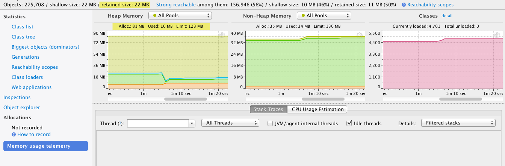

## Sample to analyze heroku dyno heap memory 

This sample is for illustrative purposes only. It is to help troubleshoot memory issues I am currently encountering with heroku dynos

#### To run the application locally

1. Clone the application
2. Change to the destination directory of the clone
3. Run __./gradlew run__ on unix or __gradlew.bat run__ on windows
4. Point your browser to [here](http://localhost:8080 "localhost")

#### Profiling
Now you can profile the application with a profiler such as [YourKit](http://www.yourkit.com/download/index.jsp "Yourkit Download")

#### Results
As per Yourkit, the retained heap memory for this application is ~ __21MB__. The same run on a dyno ([application live](http://radiant-island-7710.herokuapp.com)) on heroku is reporting __233MB__

	2013-11-07T19:47:31.914870+00:00 heroku[web.1]: source=web.1 dyno=heroku.19278499.c7ea2470-ef79-4e91-86fd-f344d971c015 sample#memory_total=233.87MB sample#memory_rss=233.80MB sample#memory_cache=0.04MB sample#memory_swap=0.03MB sample#memory_pgpgin=0pages sample#memory_pgpgout=92555pages
	2013-11-07T19:47:53.723888+00:00 heroku[web.1]: source=web.1 dyno=heroku.19278499.c7ea2470-ef79-4e91-86fd-f344d971c015 sample#load_avg_1m=0.48
	2013-11-07T19:47:53.724207+00:00 heroku[web.1]: source=web.1 dyno=heroku.19278499.c7ea2470-ef79-4e91-86fd-f344d971c015 sample#memory_total=233.87MB sample#memory_rss=233.80MB sample#memory_cache=0.04MB sample#memory_swap=0.03MB sample#memory_pgpgin=0pages sample#memory_pgpgout=92556pages

Why? What else could be consuming the additional heap space?

#### Snapshot

